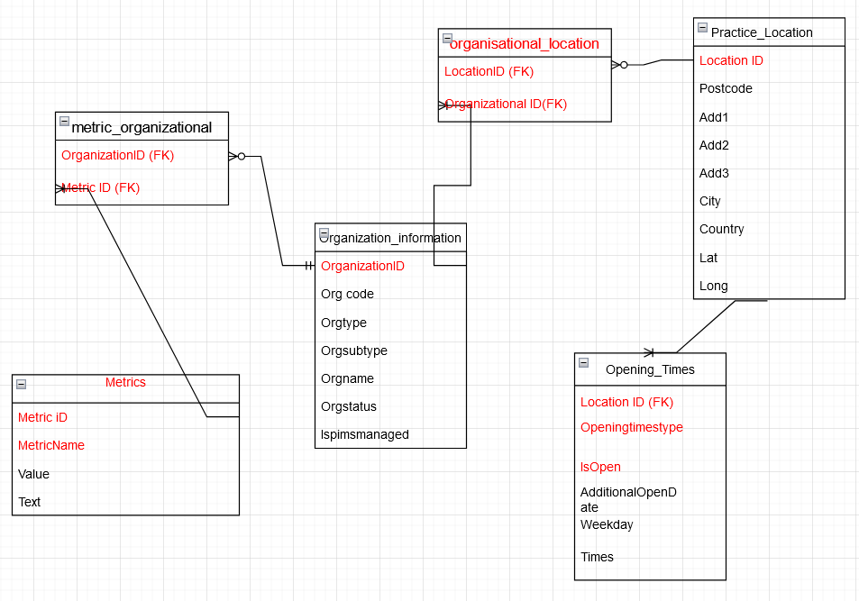

# GP_Practice_data

### Exercises
The python code for the exercise questions can be found in the GP_questions.ipynb file

### Setting up virtual enviroment

Please make use of the requirments.txt file to create the virtual enviroment on your machine. It was created using venv python module. 

### Logial Schema 

Please note that the keys in red are primary keys 

